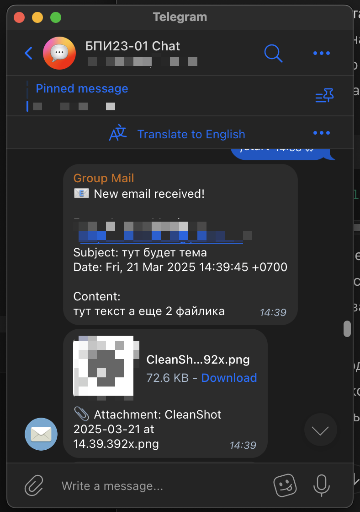

# Mail.ru to Telegram Bot

Telegram bot for forwarding emails from Mail.ru to a specified Telegram chat. Built with Python, Aiogram 3, and IMAP.



🚀 Features

- Автоматическая проверка новых писем
- Пересылка текстового содержимого писем
- Пересылка вложений
- Поддержка HTML-форматирования
- Автоматическое декодирование тем писем
- Обработка ошибок и повторные попытки

📦 Установка и запуск

1. Клонируйте репозиторий:

```bash
git clone https://github.com/yourusername/mailru-to-telegrambot.git
cd mailru-to-telegrambot
```

2. Установите зависимости (используя UV):

```bash
# Установка UV
curl -LsSf https://astral.sh/uv/install.sh | sh

# Установка зависимостей
# Установить зависимости с помощью uv
python -m pip install uv
uv sync --frozen
```

Или используя Docker:

```bash
docker build -t mailru-telegram-bot .
docker run -d --name mailru-telegram-bot mailru-telegram-bot
```

3. Создайте файл .env с настройками:

```env
# Email settings
MAIL_USERNAME=your_email@mail.ru
MAIL_PASSWORD=your_password
MAIL_SERVER=imap.mail.ru

# Telegram settings
BOT_TOKEN=your_bot_token
CHAT_ID=your_chat_id

# Application settings
CHECK_INTERVAL=300
RETRY_INTERVAL=60
```

4. Запустите бота:

```bash
uv run python3 app/main.py
```

## Разработчики

Разработано для внутреннего пользования группы БПИ23-01 университета СибГУ
